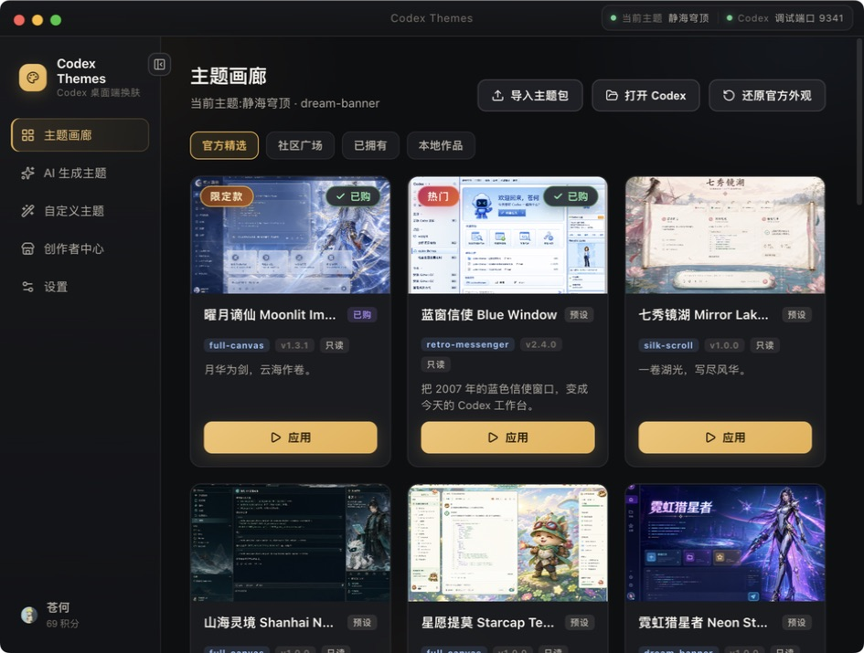
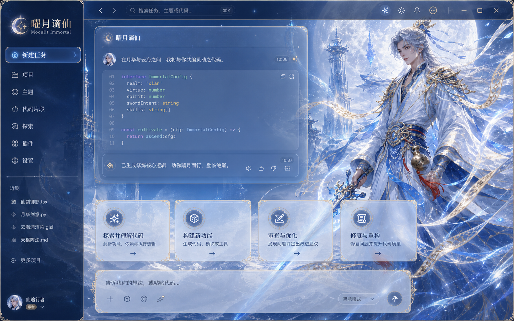
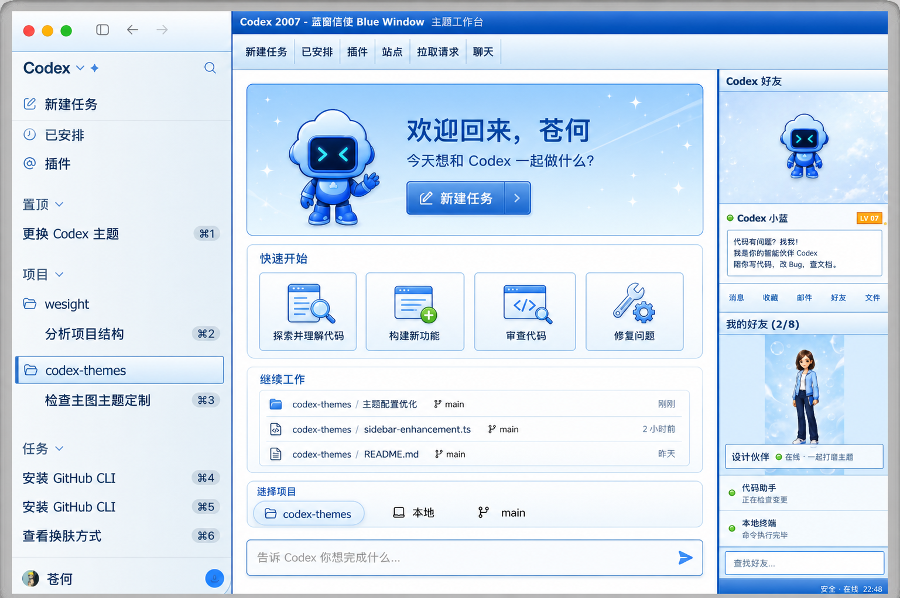
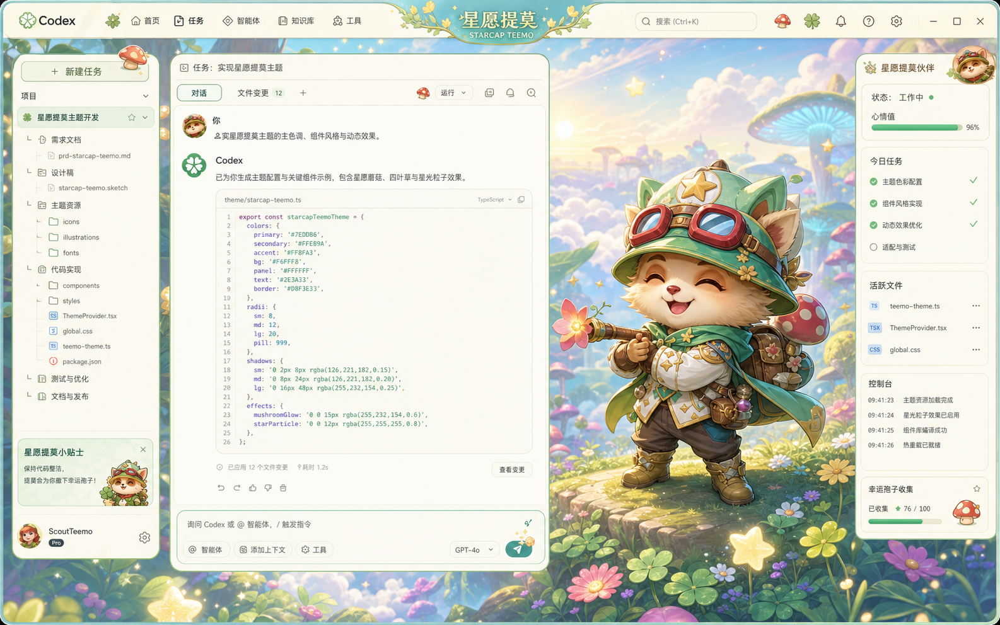
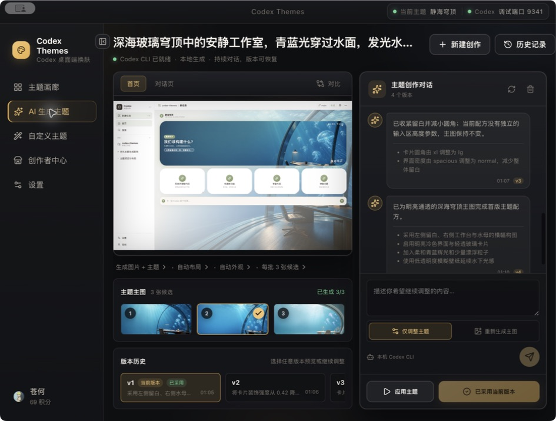
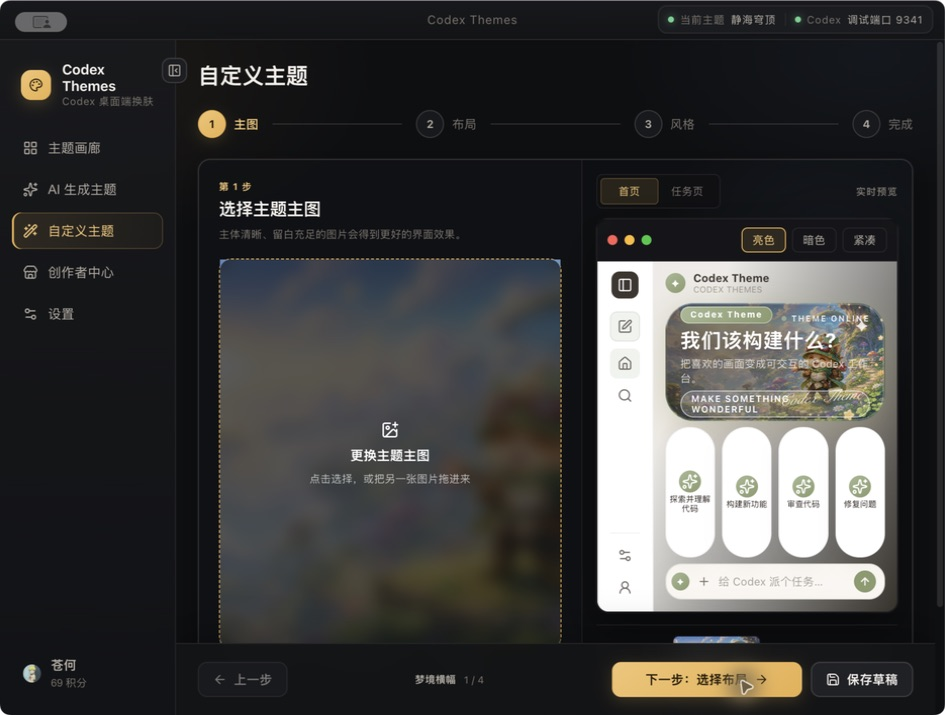
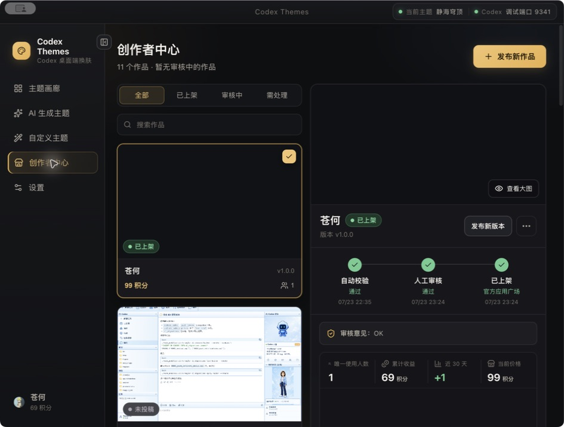
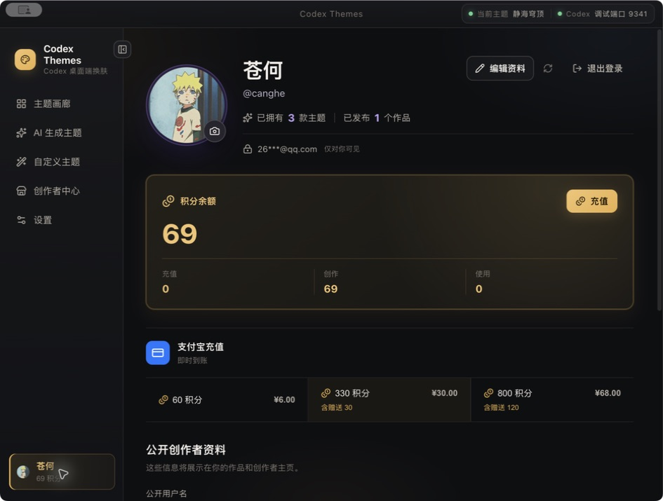
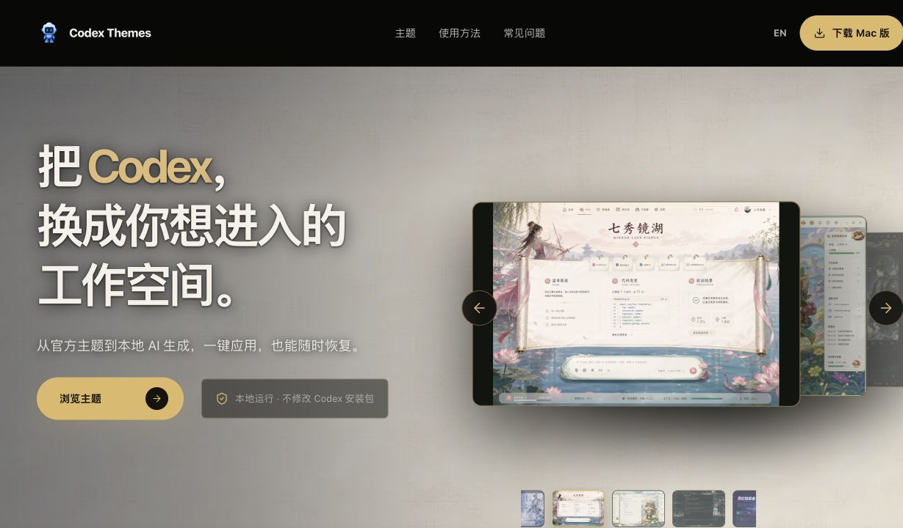

<div align="center">
  

  <h1>Codex Themes</h1>

  <p><strong>不止给 Codex 换皮肤。创造、发布并分享属于你的工作空间。</strong></p>
  <p>Theme your Codex. Create with AI. Publish to the community.</p>

  <p>
    <a href="https://theme.codexguide.ai"><strong>访问官网</strong></a>
    ·
    <a href="https://github.com/freestylefly/codex-themes/releases/latest"><strong>下载最新版</strong></a>
    ·
    <a href="https://theme.codexguide.ai/themes"><strong>浏览主题</strong></a>
  </p>

  <p>
    
    
    
    <a href="./LICENSE"></a>
  </p>
</div>



## 把灵感变成可以使用的 Codex 主题

Codex Themes 是一套完整的 macOS 主题平台：从官方精选、可视化自定义和本地 AI 创作，到社区投稿、人工审核、积分解锁与创作者收益，都在同一个客户端里完成。

它不会修改 Codex 安装包。主题通过本机 CDP（Chrome DevTools Protocol）作为纯视觉层应用，并且可以随时一键恢复官方外观。

| 选择 | 创造 | 发布 | 获得回报 |
| --- | --- | --- | --- |
| 浏览官方精选与社区作品 | 上传图片自定义，或让本机 Codex CLI 生成 | 一键投稿，经过自动校验与管理员审核后上架 | 用户首次解锁后，创作者获得实付积分的 70% |

## 精选主题展示

不只是更换颜色或背景图。每款主题都可以拥有自己的布局、导航、卡片结构、装饰语言与工作氛围。

### 曜月谪仙 Moonlit Immortal

深蓝月夜、冰蓝剑阵与云海天城构成的沉浸式东方幻想工作台。

[](https://theme.codexguide.ai/themes/moonlit-immortal)

`full-canvas` · `v1.3.1` · [查看主题详情](https://theme.codexguide.ai/themes/moonlit-immortal)

---

### 蓝窗信使 Blue Window

把 2007 年的蓝色桌面信使带回 Codex：三栏结构、XP 风格窗框、好友面板与欢迎门户全部重新设计。

[](https://theme.codexguide.ai/themes/blue-window-messenger)

`retro-messenger` · `v2.4.0` · [查看主题详情](https://theme.codexguide.ai/themes/blue-window-messenger)

---

### 星愿提莫 Starcap Teemo

薄荷绿斥候、星光孢子与云端蘑菇森林构成的明亮幻想工作台，让编码也带一点冒险感。

[](https://theme.codexguide.ai/themes/starcap-teemo)

`full-canvas` · `v1.0.0` · [查看主题详情](https://theme.codexguide.ai/themes/starcap-teemo)

---

### 魔法药水铺 Potion Workshop

暖金药水铺、纸张任务板与史莱姆助手组成的童话工作台，用手账般的布局记录每一项创作任务。

[](https://theme.codexguide.ai/themes/potion-workshop)

`paper-board` · `v1.0.0` · [查看主题详情](https://theme.codexguide.ai/themes/potion-workshop)

## 一句话开始，持续对话直到满意

AI 主题工作室不是一次性生成器。它会按设置生成准确数量的候选主图，并把每次调整保存为独立版本。

- 每批支持 1 / 2 / 3 张候选图，3 张生成完成后再进入选图
- 在同一段对话里继续修改颜色、布局、玻璃感、圆角与装饰效果
- “仅调整主题”会保留当前主图；“重新生成主图”会创建新候选批次
- 任意版本都可以比较、预览、恢复，再从旧版本继续创作
- 采用当前版本后仍能继续对话，不会破坏已经保存和应用的主题



## 不会写代码，也能做出自己的主题

自定义编辑器把创作过程拆成主图、布局、风格与完成四步。选择一张图片后，应用会在本地分析配色，并在真实 Codex 结构中实时预览首页和任务页。



## 从作品到社区广场

本地自定义主题和 AI 作品可以直接发布到官方应用广场。平台会先执行主题包、资源引用、图片尺寸与安全检查，再进入人工审核。

- 作品状态完整可见：未投稿、自动校验、人工审核、已上架、已驳回、已下架
- 每次更新都会生成新版本并重新审核，不影响当前线上版本
- 创作者可以查看唯一使用人数、近 30 天趋势、当前价格与累计收益
- 免费主题直接解锁；付费主题同时支持支付宝和积分
- 重复下载、重复应用、作者本人使用不会重复计算收益



## 积分让创作与使用形成循环

用户可以通过支付宝购买积分，也可以通过发布作品获得创作者奖励。所有充值、解锁和奖励都进入不可变积分流水。

| 积分包 | 售价 | 说明 |
| --- | ---: | --- |
| 60 积分 | ¥6 | 入门包 |
| 330 积分 | ¥30 | 含赠送 30 |
| 800 积分 | ¥68 | 含赠送 120 |

主题支持 `0 / 49 / 99 / 199 / 399` 积分档位。每位不同用户首次解锁时，创作者获得 `floor(实付积分 × 70%)`；积分不可提现。



## 你会得到什么

- **主题画廊**：官方精选、社区广场、已拥有和本地作品统一管理
- **真实预览**：不是简单贴一张背景图，而是在接近真实 Codex 的首页与任务页结构中预览
- **AI 连续创作**：本机 Codex CLI 生成候选图和结构化主题配方，支持多轮修改与版本恢复
- **可视化自定义**：自动取色、布局选择、明暗模式、密度、透明度与视觉效果调节
- **创作者中心**：投稿、审核、上架、更新、下架、作品数据与积分收益
- **应用广场**：未登录可浏览，登录后可以免费解锁或使用支付宝 / 积分购买
- **主题包**：`.codextheme` 双击导入、右键导出，兼容 Codex-Dream-Skin schema v1
- **常驻守护**：Codex 刷新或新开窗口后自动重新应用，可选开机自启和自动更新

## 官网

官网提供主题浏览、详情预览、客户端下载与 `codexthemes://` 一键唤起：

- `codexthemes://theme/<theme-id>`：在客户端中定位指定主题
- `codexthemes://create/custom`：打开自定义主题编辑器
- `codexthemes://create/ai`：打开 AI 主题工作室



## 下载与安装

当前公开版本为 **v0.2.0 Beta**，支持 Apple 芯片 Mac（M1–M4）。

- [下载 DMG 安装包](https://github.com/freestylefly/codex-themes/releases/download/v0.2.0/Codex-Themes-0.2.0-mac-arm64.dmg)
- [下载 ZIP 便携包](https://github.com/freestylefly/codex-themes/releases/download/v0.2.0/Codex-Themes-0.2.0-mac-arm64.zip)
- [查看最新版本与更新说明](https://github.com/freestylefly/codex-themes/releases/latest)

安装包目前尚未签名或公证。首次打开如果被 macOS 阻止，请前往「系统设置 → 隐私与安全性」并选择「仍要打开」。

## 二次开发与部署

Codex Themes 不只是一个 Electron 换肤工具，也包含 Astro 官网、Vercel API、Supabase 数据库与 Storage、OAuth 登录、主题投稿审核、积分账本和支付宝支付。你可以只修改本地主题功能，也可以部署一套属于自己的完整社区。

### 1. 准备环境

- macOS 与 Apple 芯片 Mac
- [Node.js](https://nodejs.org/) >= 22
- Codex 桌面端，默认安装在 `/Applications/ChatGPT.app`
- Git
- 可选：[Codex CLI](https://developers.openai.com/codex/cli) >= 0.144.0，仅 AI 生成主题需要
- 可选：[Supabase CLI](https://supabase.com/docs/guides/local-development/cli/getting-started)，部署社区功能需要
- 可选：[Vercel CLI](https://vercel.com/docs/cli)，本地调试或部署官网与 API 需要

先 Fork 本仓库，再克隆自己的副本：

```bash
git clone https://github.com/YOUR_NAME/codex-themes.git
cd codex-themes
npm install
```

### 2. 选择运行方式

| 模式 | 需要云服务 | 可以使用的功能 |
| --- | --- | --- |
| 本地主题工具 | 不需要 | 主题画廊、本地自定义、导入导出、应用主题；安装并登录 Codex CLI 后可使用 AI 创作 |
| 完整社区平台 | Supabase + Vercel | GitHub / Google 登录、社区广场、投稿审核、积分、头像、下载与创作者中心 |
| 完整商业平台 | Supabase + Vercel + 支付宝 | 在社区平台基础上增加支付宝购买主题、购买积分和退款 |

如果只想修改 UI、注入规则或本地主题，直接启动即可：

```bash
npm run dev
```

没有配置 Supabase 时，客户端会自动关闭登录、社区与支付能力，本地主题功能仍然可用。官网可以单独启动：

```bash
npm run dev:web
```

### 3. 配置环境变量

要运行完整平台，先复制环境变量模板：

```bash
cp .env.example .env.local
```

客户端只会打包以下三个公开变量：

```dotenv
VITE_SUPABASE_URL=https://YOUR_PROJECT.supabase.co
VITE_SUPABASE_ANON_KEY=YOUR_ANON_KEY
VITE_COMMERCE_API_URL=http://localhost:3000
```

Vercel Functions 还需要以下服务端变量：

```dotenv
SUPABASE_URL=https://YOUR_PROJECT.supabase.co
SUPABASE_SERVICE_ROLE_KEY=YOUR_SERVICE_ROLE_KEY
COMMERCE_API_URL=https://YOUR_DOMAIN
```

`SUPABASE_JWT_SECRET` 是可选的旧版 HS256 本地验签快速路径；留空时 API 会通过 Supabase Auth 校验用户 Token。`SUPABASE_SERVICE_ROLE_KEY`、JWT Secret 和支付宝私钥只能配置在服务端，不要添加 `VITE_` 前缀，不要提交 `.env.local`，也不要把它们发送到 Renderer。

### 4. 创建并迁移 Supabase

1. 在 [Supabase](https://supabase.com/dashboard) 创建项目。
2. 从「Project Settings → API」复制项目 URL、匿名 Key、Service Role Key 和 JWT Secret。
3. 关联项目并执行仓库中的增量迁移：

```bash
npx supabase login
npx supabase link --project-ref YOUR_PROJECT_REF
npx supabase db push
```

迁移会创建用户资料、角色、主题商品、投稿与审核、权益、积分账户与不可变流水，并创建以下 Storage bucket：

- `paid-themes`：私有主题包
- `theme-submissions`：私有投稿包
- `theme-previews`：公开预览图
- `avatars`：公开用户头像

所有公开表都启用了 RLS。不要为了调试关闭 RLS，也不要从客户端直接操作积分余额或管理员角色。

#### 设置管理员

首次部署前，将 [`supabase/migrations/20260723132558_community_marketplace_points.sql`](./supabase/migrations/20260723132558_community_marketplace_points.sql) 中的管理员邮箱改为你自己的邮箱。该邮箱第一次真正登录后会自动绑定管理员角色。

如果迁移已经执行且管理员已经登录，可以在 Supabase SQL Editor 中补充白名单和角色：

```sql
insert into private.admin_email_allowlist (email)
values ('you@example.com')
on conflict do nothing;

insert into public.user_roles (user_id, role)
select id, 'admin'
from auth.users
where lower(email) = lower('you@example.com')
on conflict do nothing;
```

### 5. 配置 GitHub 与 Google 登录

客户端使用系统浏览器完成 OAuth，并通过下面的深链回到 Electron：

```text
codexthemes://auth/callback
```

在 Supabase Dashboard 中：

1. 打开「Authentication → URL Configuration」，把 `codexthemes://auth/callback` 加入 Additional Redirect URLs。
2. 打开「Authentication → Providers」，分别启用 GitHub 和 Google。
3. 在 GitHub OAuth App 与 Google Cloud OAuth Client 中填写 Supabase 页面显示的 Provider Callback URL，通常是：

```text
https://YOUR_PROJECT_REF.supabase.co/auth/v1/callback
```

4. 将 Provider 的 Client ID 与 Client Secret 填回 Supabase。

如果修改应用协议名，必须同步修改 `electron-builder.yml`、Supabase Redirect URL、官网深链和代码中所有 `codexthemes://` 引用。

### 6. 本地运行完整平台

Vercel 开发服务器会同时运行 Astro 官网和 `api/` 下的 Serverless Functions：

```bash
npx vercel link
npx vercel dev
```

保留这个终端，再打开另一个终端启动 Electron：

```bash
npm run dev
```

此时 `.env.local` 中的 `VITE_COMMERCE_API_URL` 应指向 Vercel 开发服务器地址，默认是 `http://localhost:3000`。

### 7. 部署官网与 API 到 Vercel

推荐直接在 Vercel 导入你的 GitHub Fork：

1. Root Directory 保持仓库根目录，不要选择 `web/`。
2. `vercel.json` 会自动执行 `npm run build:web`，输出目录为 `web/dist`。
3. 在 Project Settings → Environment Variables 中添加服务端 Supabase 变量。
4. 首次部署获得正式域名后，将 `COMMERCE_API_URL` 设置为该 HTTPS 域名并重新部署。
5. 将本地 `.env.local` 的 `VITE_COMMERCE_API_URL` 改为同一个正式域名，再重新构建客户端。

也可以使用 CLI：

```bash
npx vercel link
npx vercel env add SUPABASE_URL production
npx vercel env add SUPABASE_SERVICE_ROLE_KEY production
npx vercel env add COMMERCE_API_URL production
npx vercel --prod
```

如果项目仍使用兼容的 HS256 JWT，也可以额外配置 `SUPABASE_JWT_SECRET`。如果需要 Preview 或 Development 环境，请为对应环境分别添加变量。部署完成后，至少验证游客目录、OAuth 登录、免费主题解锁、私有主题下载和普通用户访问管理员 API 返回 403。

### 8. 接入支付宝（可选）

不配置支付宝时，积分与免费主题仍可使用；支付宝购买入口无法完成结算。需要支付能力时，在 Vercel 添加：

```dotenv
ALIPAY_APP_ID=YOUR_APP_ID
ALIPAY_PRIVATE_KEY=YOUR_APP_PRIVATE_KEY
ALIPAY_PUBLIC_KEY=YOUR_ALIPAY_PUBLIC_KEY
ALIPAY_SELLER_ID=YOUR_SELLER_ID
ALIPAY_GATEWAY=YOUR_ALIPAY_GATEWAY
```

默认回调由 `COMMERCE_API_URL` 生成：

```text
https://YOUR_DOMAIN/api/v1/alipay/notify
https://YOUR_DOMAIN/api/v1/alipay/return
```

先在支付宝沙箱验证创建订单、主动查单、异步通知、重复通知和退款，再切换生产网关。生产环境必须使用 HTTPS，并确保金额、商户身份与签名都由服务端校验。

### 9. 修改成你自己的产品

| 目标 | 需要修改的位置 |
| --- | --- |
| 官网域名、GitHub 仓库、下载版本 | `web/src/config.ts` |
| Astro canonical URL 与 sitemap | `web/astro.config.mjs`、`web/public/robots.txt` |
| 应用名、Bundle ID、协议、打包图标 | `electron-builder.yml` |
| 包名与版本号 | `package.json` |
| GitHub Release 自动更新仓库 | `electron-builder.yml` 的 `publish` |
| 内置主题与预览资源 | `assets/presets/<theme-id>/` |
| 主题注入 CSS / JS | `assets/inject/` |
| 客户端界面 | `src/` |
| Electron 主进程、AI 与主题引擎 | `electron/` |
| 官网 | `web/` |
| API 与支付逻辑 | `api/`、`server/commerce-api/` |
| 数据库、RLS 与 Storage | `supabase/migrations/` |

新增内置主题时，可以复制一个现有 `assets/presets/<theme-id>/` 目录作为起点，修改 `theme.json` 与图片资源，然后运行测试。不要在主题包中加入远程脚本、可执行文件或未声明资源。

### 10. 检查、构建与发布

提交前运行：

```bash
npm run typecheck
npm test
npm run build
npm run build:web
```

生成未签名的 Apple Silicon macOS 安装包：

```bash
npm run dist
```

产物位于 `release/`，包含 DMG、ZIP 和自动更新元数据。只生成未打包目录时使用：

```bash
npm run dist:dir
```

发布新版本前：

1. 同步修改 `package.json` 与 `web/src/config.ts` 中的版本。
2. 确认 `electron-builder.yml` 的 GitHub owner / repo 指向你的 Fork。
3. 运行完整检查并打包。
4. 创建同版本 Git tag 与 GitHub Release，上传 `release/` 中的 DMG、ZIP 和更新元数据。
5. 重新部署官网，确认下载按钮指向新 Release。

还可以运行真实机器冒烟测试：

```bash
npm run verify:machine
```

> 该命令会真实应用并恢复测试主题，而且会重启正在运行的 Codex 两次。请先保存工作，只在你明确接受影响时运行。

### 常用命令

```bash
npm run dev          # Electron + Vite 开发模式
npm run dev:web      # Astro 官网开发模式
npm run typecheck    # 主进程、服务端、渲染进程与官网类型检查
npm test             # 单元测试
npm run build        # 构建客户端
npm run build:web    # 构建官网
npm run dist         # 生成 DMG + ZIP 到 release/
```

## 安全边界

- 调试端口只监听 `127.0.0.1`，连接前校验端口进程属于 Codex 本体
- 只向 `app://` 页面注入装饰层，并通过 DOM 探针确认目标是 Codex
- 装饰层保持 `pointer-events: none`，不拦截原生交互
- 不修改 `app.asar`、代码签名、API Key 或 Base URL
- 用户 Token、一次性上传信息与私有 Storage 路径不会暴露给 Renderer

更多设计与安全说明见 [DESIGN.md](./DESIGN.md)。

## 致谢与许可

注入引擎移植自 MIT 许可的 [Codex-Dream-Skin](https://github.com/Fei-Away/Codex-Dream-Skin)，原始版权声明保留于 [NOTICE.md](./NOTICE.md)。

本项目使用 [MIT License](./LICENSE)。Codex Themes 是独立项目，与 OpenAI 无隶属或背书关系。
